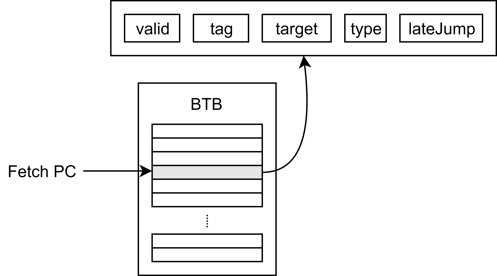

# 分支预测单元

在冯诺依曼体系结构中, 指令供给的效率极大地影响了处理器的性能. NutShell处理器核在取指单元中加入了硬件分支预测器, 用于在转移指令的取指阶段预测出指令跳转的方向和目标地址, 并从预测的目标地址处继续取指令执行, 在一定程度上减轻指令流水线中转移指令引起的阻塞, 从而提高处理器的性能.

## Next-Line分支预测器

NutShell核的前端每周期会在取指前一拍访问分支预测器, 并在下个周期返回结果. 如果预测正确, 指令流水线就不会断流. 我们采用了Next-Line分支预测器（Next-Line Predictor, NLP）, 通过综合考虑分支目标缓冲器（Branch Target Buffer, BTB）、模式历史表（Pattern History Table, PHT）和返回地址栈（Return Address Stack, RAS）对不同类型的转移指令做出快速的预测.

### 预测机制

BTB中缓存了跳转指令的地址高位信息、跳转目标、指令类型等信息. 在做分支预测时会用取指PC索引BTB表项, 如果PC高位与读到的BTB表项的标签匹配则认为BTB命中, 再根据BTB中记录的指令类型判断跳转方向和跳转目标. 如果类型为条件分支指令, 则需要访问模式历史表（PHT）来判断是否跳转; 如果类型为返回指令, 则选择返回地址栈（RAS）的栈顶内容作为跳转目标; 如果类型为直接或间接跳转指令, 则选择BTB中记录的跳转目标.

当分支预测器判断一条指令为条件分支跳转时, 需要访问PHT进一步对跳转方向做出预测. PHT的每一项都是一个两位饱和计数器, 计数器的内容指示了强跳转、弱跳转、弱不跳转、强不跳转四种分支指令可能所处的状态, 该两位计数器的高位则指示了分支预测的方向.

在分支预测器中, RAS和PHT用同步写异步读的寄存器来实现, BTB由于面积较大而通过快速SRAM来实现, 因此在访问前者时需要将取指PC缓存一拍. 结合三者预测跳转方向和跳转目标可以在两拍之内完成, 因此如果预测正确, 将不会有取指空泡产生.

### 更新机制

在初始化阶段, BTB所有表项都是无效的, 当跳转指令第一次被取出时都会按不跳转来处理. 后端的执行单元发现指令跳转目标错误或者方向错误时会刷新流水线, 同时更新BTB相应的表项. 如果取指PC对应的表项无效或已被占用, 则重新分配该表项.

与此同时, 后端每执行一条条件分支指令, 都会将正确跳转方向和分支目标等信息返回给分支预测单元, 分支预测器会更新PHT, 按照如下图所示的状态机更新两位饱和计数器.

后端每执行一条函数调用指令（call）或函数返回指令（ret）, 也会将相关信息传给分支预测器. 如果该指令是call指令, 则根据指令的宽度（4字节或2字节）计算返回地址并写入RAS栈顶; 如果该指令是ret指令, 则将RAS的栈顶弹出.
