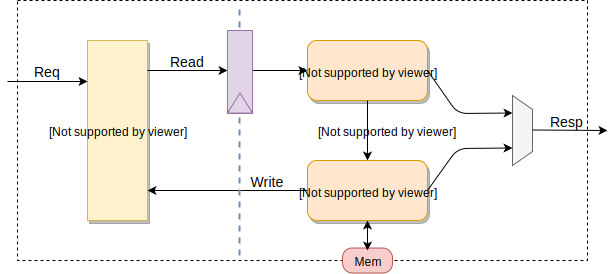

# TLB

NutShell 支持 Sv39 分页方案和虚实地址转换，因此页表缓冲（TLB，Translation Lookaside Buffer）是处理器的一个关键部件，它实现得好坏直接决定了地址转换的性能. 

NutShell 包含一个 4 项 4 路组相连的指令页表缓冲（ITLB）和一个 64 项 4 路组相连的数据页表缓冲（DTLB），它们的结构图如下所示：

TLB采用四路组相连结构，分为ITLB和DTLB，分别接收来自IFU和LSU的访存请求，并将虚地址转换为实地址。代码实现上，TLB分为主模块和执行模块，主模块负责TLB模块IO接口，并将地址转换功能分给执行模块。

当TLB命中时可一拍得到实地址结果，如果不命中，则通过状态机方式实现的HWPTW（HardWare Page Table Walker）访存页表，并进行对页表的填充，同时会阻塞后续指令进入TLB。为了保持TLB的一致性，ITLB和DTLB都经过DCache（Data Cache）进行访存，当sfence.vma指令修改satp寄存器内容时，需要将TLB内容刷为无效（也可通过asid域避免TLB的刷新）。Sv39采用三级页表，因此当TLB未命中时需要访问三次内存，因此具有很大的性能损失。无论命中与否，都需要根据读写行为和页表项状态位等判断权限是否合法，以及是否需要回写页表项状态位。如果ITLB权限不合法，为了保证指令执行的正确顺序，需要等待ICache（Instruction Cache）清空后将例外信息传给IFU（或流水线）；如果DTLB不合法，由于访存已经处于执行阶段，会直接将例外传给LSU（Load Store Unit），考虑到关键路径延迟，会将例外信息缓存一拍发出。