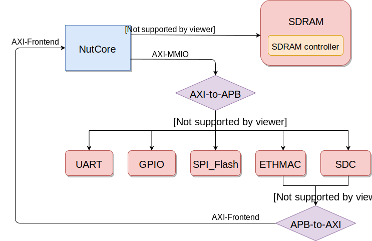

# 外设系统

本节主要介绍 NutShell 所使用的外设系统. 由于实现的原因, 我们在仿真和流片版本使用了不同的外设系统, 其中仿真外设示意图如下：

流片外设示意图如下：

## NutShell SoC

NutShell SoC主要由NutCore处理器以及各个外设IP核, 以及SDRAM控制器组成. NutCore提供了对外的AXI-MEM接口（AXI4协议）, 与SDRAM控制器连接. 而MMIO空间则是通过AXI-MMIO（AXI-Lite协议）接口, 通过信号转换为APB总线信号. APB信号选择器会根据访问的地址空间将NutShell的访问信号（master）传递给不同的外设控制器（slave）, 达到对MMIO空间进行访问的目的.   

各个外设IP会将APB信号转换为内部控制器的信号, 来进行对外设IP内部寄存器的读写. 而ETHMAC以及SDC两种外设还需要实现对主存进行读写, 因此这两个外设的信号能作为APB master, 转换为AXI-frontend(AXI4协议),接入到NutCore. 这个信号在NutCore内部会转换为一个对Data Cache的SimpleBus访存请求. 

## 外设

我们的外设IP来源于opencore这样的开源网站

* UART（Universal Asynchronous Receiver/Transmitter）, 用于NutCore对串口的输入输出. 
* GPIO（General-purpose input/output）,我们使用4个GPIO输入端口作为我们的中断输入端口, 连接到各个外设IP的中断信号. 当外设产生中断时, 会使能GPIO中断并向NutCore处理器发送中断. 
* SPI_Flash 我们使用SPI（Serial Peripheral Interface）信号端口的Flash来作为我们的ROM, NutCore会从SPI_Flash中读取第一条指令. 
* ETHMAC 以太网控制器, SoC通过Tx端发送以太网帧. 而当Rx接收到数据时, 会作为APB master向NutCore发送AXI-fronten写请求写入DMA接收地址. 
* SDC 已经流片的板子上我们实现了SDHC(Secure Digital High Capacity)以及SPI两种接口的SDC controller

